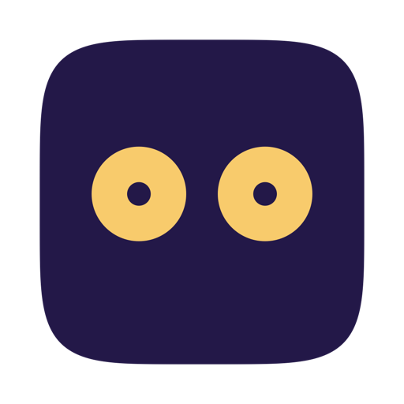

<p align="center">
  
</p>

<h1 align="center">NightOwl</h1>

<p align="center">
  A tiny macOS menu bar app that keeps your Mac awake for overnight AI agent runs, without the jargon.
</p>

<p align="center">
  
</p>

## Why

You walk away from your Mac while an AI agent, long job, or overnight script is still running. macOS helpfully sleeps the display, locks the screen, and in some cases logs you out. Your job dies. NightOwl is one toggle in the menu bar that prevents idle sleep cleanly, using Apple's public power-management API, and warns you about system settings that could still interrupt the run (battery, clamshell, auto-logout, screen lock).

## Features

- **One-click keep-awake** - one menu bar toggle holds a system sleep assertion until you release it
- **Awake modes** - Indefinite, Until next 8:00 AM, For 1 / 4 / 8 / 12 hours, or custom release time
- **Keep display awake too** - optional second assertion that also blocks display sleep, preventing the lock screen that would otherwise engage when the display turns off
- **Active-state icon** - the menu bar icon tints your accent color while a session is running, so you can tell at a glance without opening the popover
- **Expiry notification** - a system notification is posted when a timed session ends, so you know the keep-awake window has closed
- **Persistent defaults** - Settings lets you pick the default mode (including custom hours/minutes) and whether Keep display awake too starts on; stored in `UserDefaults` and applied at launch
- **Sleep/wake aware** - if macOS sleeps for any reason the assertion can't block, NightOwl re-anchors or releases the session to wall-clock time when it wakes
- **Smart warnings** - flags battery, lid-closed, auto-logout, and screen-lock conditions; each links to System Settings; re-checked every time the popover opens
- **Device-aware** - battery and clamshell warnings only on MacBooks; UPS-attached desktops are correctly classified as desktops
- **Status line** - session start, scheduled release, and time remaining
- **Launch at login** - `SMAppService` toggle in Settings
- **No dock icon** - menu bar only (`NSStatusItem` with `.accessory` activation policy)
- **Pure IOKit** - `IOPMAssertionCreateWithName` direct; no `caffeinate`, no background processes

## Install

1. Download `NightOwl-vX.X.X.zip` from the [latest release](https://github.com/amandeepmittal/nightowl/releases/latest)
2. Unzip and move `NightOwl.app` to your Applications folder
3. Remove the quarantine flag **before** first launch (required once for unsigned builds):
   ```bash
   xattr -cr /Applications/NightOwl.app
   ```
4. Open `NightOwl.app` from Applications or Spotlight

### If you already double-clicked and saw "NightOwl.app Not Opened"

macOS 15+ shows a Gatekeeper dialog whose primary button is **Move to Trash**. Do **not** click it (it will delete the app). Recover by:

1. Click **Done** to dismiss the dialog.
2. Open **System Settings → Privacy & Security**, scroll to the Security section, and click **Open Anyway** next to the NightOwl entry.
3. Confirm with your password, then reopen NightOwl.

Alternatively, run the `xattr -cr` command from step 3 above and reopen — it bypasses the prompt entirely.

## Verify it is working

While NightOwl's toggle is ON, run:

```bash
pmset -g assertions | grep NightOwl
```

You should see `PreventUserIdleSystemSleep` held by `NightOwl keep-awake`, and (if Keep display awake too is on) a second `PreventUserIdleDisplaySleep` assertion named `NightOwl keep-display-awake`. Flip the toggle off, re-run the command, and both should be gone.

## Requirements

- macOS 13 (Ventura) or later
- Xcode 15+ (to build from source)

## Tech Stack

- Swift 5.9, SwiftUI
- `NSStatusItem` + `NSPopover` for menu bar integration
- IOKit (`IOPMAssertionCreateWithName`, `IOPSCopyPowerSourcesList`, `IOPSNotificationCreateRunLoopSource`) for sleep prevention and power-source monitoring
- `NSWorkspace.didWakeNotification` observation to re-anchor sessions after system wake
- `UserNotifications` for end-of-session alerts
- `CFPreferences` for reading system login and screensaver settings
- `UserDefaults` for persisting the user's default mode and display-awake preference
- `SMAppService` for launch-at-login on macOS 13+
- `DispatchSourceTimer` for auto-release scheduling
- CoreGraphics + ImageIO for the generated app and menu bar icons (see `NightOwl/Assets.xcassets/AppIcon.appiconset/_generate_icons.swift`)
- No third-party dependencies

## License

Apache-2.0

## Author

[Aman Mittal](https://amanhimself.dev)
